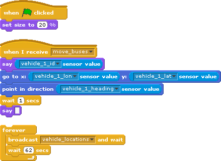

# Scratch2Nextbus

With Scratch2Nextbus you can write a [Scratch 1.4](http://scratch.mit.edu) program that knows about your City's transit system via the [NextBus](http://www.nextbus.com/) API

## Requirements

- [Scratch 1.4](http://scratch.mit.edu/scratch_1.4/) - Programing environment
- A City where [Nextbus](http://cts.cubic.com/en-us/solutions/realtimepassengerinformation/nextbus,inc/hownextbusworks.aspx) is affiliated with an Transit Agency

## Installation

- currently depends on my local fork of the nextbus gem so isn't usable by anyone else until I do something about that...

## Getting Started

- You need to set a route_id global variable in your scratch program
- broadcast "route_config"
- To deal with stops on the route, see the [draw stops example](./examples/screenshots/draw_stops_1.gif) for now to use the add_to_stops, clear_stops, and draw_stops broadcasts
- To update the vehicle location sensors, broadcast "vehicle_locations" and have something recieve "move_buses" as demonstrated in the  screenshot.

## Examples

### Scripts

### Movies

## Resources & References

- [Discuss scratch2nextbus on Scratch Forums](http://scratch.mit.edu/discuss/topic/30696/)
- [Scratch's Remote Sensor Control Protocol](http://wiki.scratch.mit.edu/wiki/Remote_Sensors_Protocol) (outdated in 2.0)